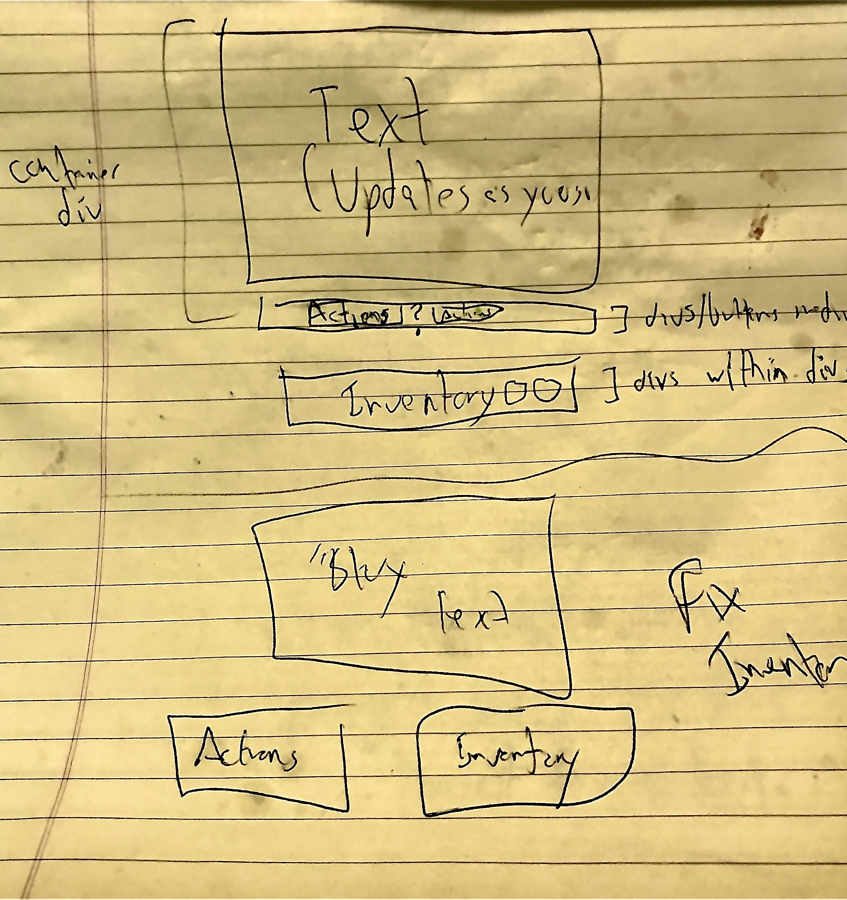

# SEI Project 1: "Classy Dinner Adventure"

### Demo: https://lind1125.github.io/SEI_project1/

---

## Concept:

A text-based game using a point-and-click interface to interact with the game. Using OOP and DOM Manipulation, clicking particular areas on page in particular sequences will produce specific results. A particular sequence of results will progress the user forward.

The goal of the game is to get into a fancy restaurant and successfully order a meal. You accomplish this goal by acquiring and/or manipulating things and/or people around you. Once you've successfully ordered a meal, you win!

## Technologies Used
* HTML
* CSS
* Javacript
* Written in [VS Code](https://code.visualstudio.com/) 

## Approach:

#### Overview
I first created a puzzle dependency chart to nail down what actions should be taken in what sequence to win the game.

##### Puzzle Dependency Chart for "Classy Dinner Adventure"

I then created a couple of rough wireframes, ultimately combining layout concepts from the two.

#### Wireframe

I then built out the interactive inventory objects and the first "room" in order to have a sandbox to figure out the necessary functions for the game to take in input and execute properly.

Once all primary functions were running, I built out the other rooms and interactive objects, structuring the necessary sequence of actions for a win scenario as I went.

#### User stories

As a user, I expect to see a set of action buttons to select how I would like to interact with the other clickable elements on the page. I expect all inventory items to be interactive. I expect clear visual information to denote what other elements on the page are interactive. I expect clear visual information to denote when an element has been selected.

#### Development Plan

## Acknowledgements
* Thanks to Taylor Darneille for the assist in getting the click even behavior to work properly for the interface to be used correctly.
* Thanks to Bruno DaSilva
* Thanks to Ron Gilbert for designing many games of my childhood using a similar interface, as well as publishing the design concept known as the [puzzle dependency chart](https://grumpygamer.com/puzzle_dependency_charts)
* Modal box code modified from [W3 Schools](https://www.w3schools.com/howto/howto_css_modals.asp)
